<div align="center">


# Manit Hub

### The student super‑app for MANIT Bhopal — marketplace, study groups, study vault, real‑time chat & campus maps, in one place.

Manit Hub brings campus life at **Maulana Azad National Institute of Technology (NIT Bhopal)** into a single, premium experience.
Built by students, for students — a verified, university‑scoped community on the **web** and as a native **Android** app.

<br/>

[](LICENSE)
[](https://github.com/Samay-Jain/Manit-Hub/stargazers)
[](https://github.com/Samay-Jain/Manit-Hub/network/members)
[](https://github.com/Samay-Jain/Manit-Hub/issues)
[](https://github.com/Samay-Jain/Manit-Hub/commits)

<br/>


<br/>

[**🌐 Live Demo**](https://manithub-samayjainbm.netlify.app/) · [**▶️ Demo Link**](https://example.com/demo) · [**📱 Android App**](#-mobile-app-android) · [**🐛 Report Bug**](https://github.com/Samay-Jain/Manit-Hub/issues) · [**✨ Request Feature**](https://github.com/Samay-Jain/Manit-Hub/issues)

</div>

---

## 🎬 Demo

<div align="center">

<a href="https://example.com/demo">
  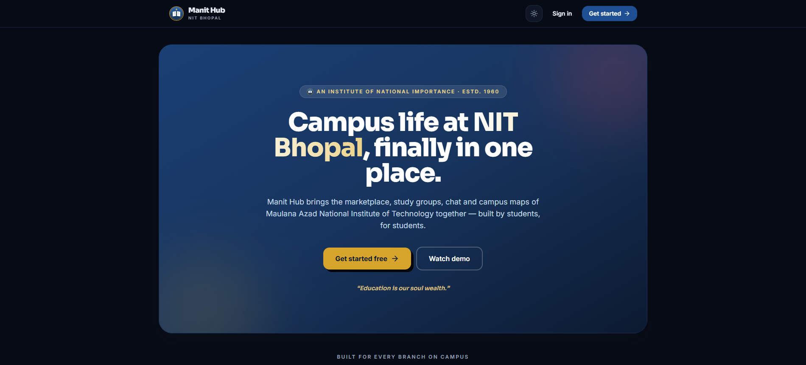
</a>

<sub>▶️ Click to open the demo link</sub>

</div>

> Add UI captures to `docs/screenshots/` and they'll render below.

<div align="center">

| Landing | Dashboard | Marketplace |
| :---: | :---: | :---: |
|  | 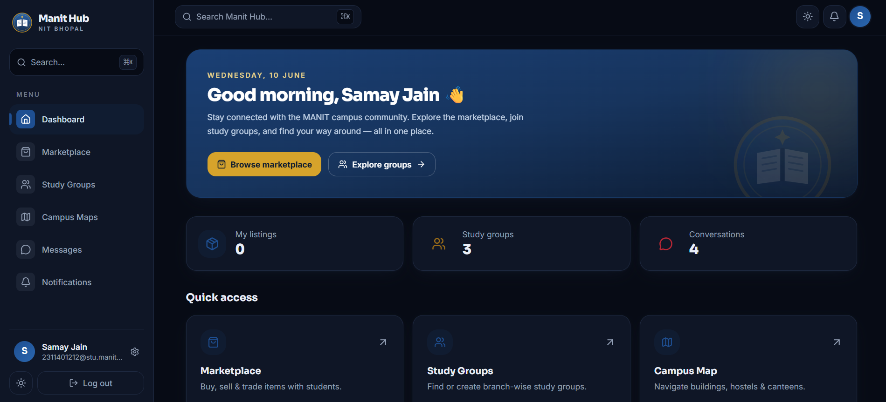 | 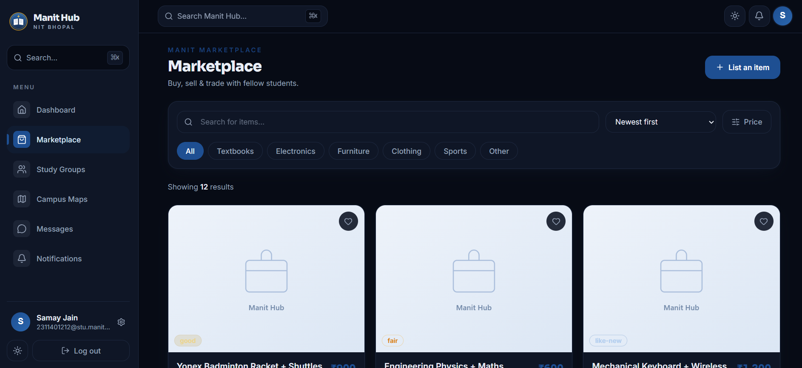 |
| **Study Groups** | **Real-time Chat** | **Campus Maps** |
| 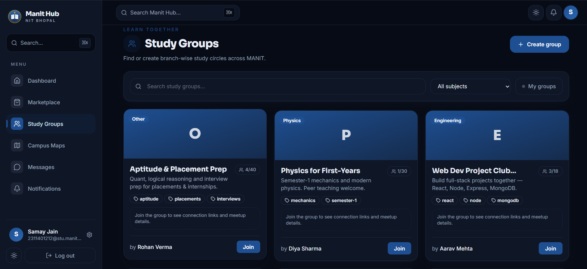 | 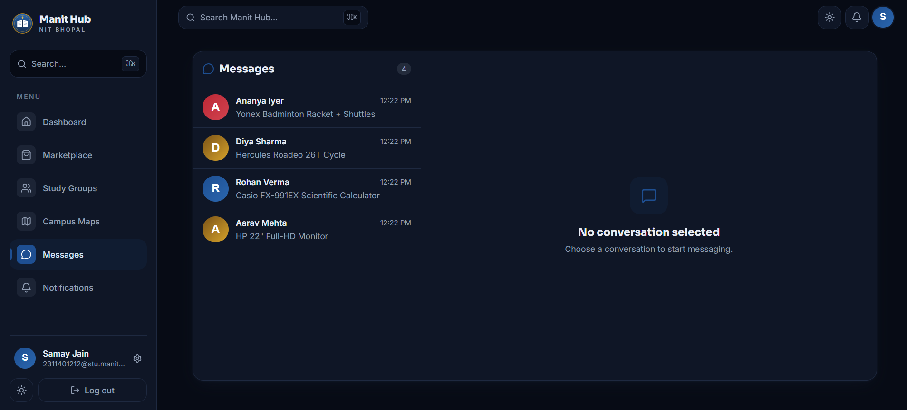 | 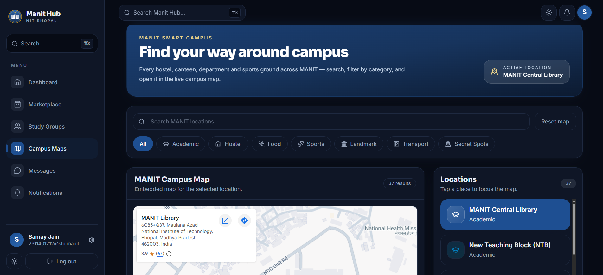 |
| **Login** | **Study Vault** | |
| 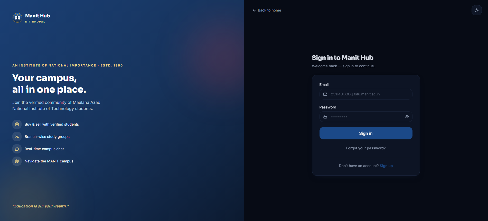 | 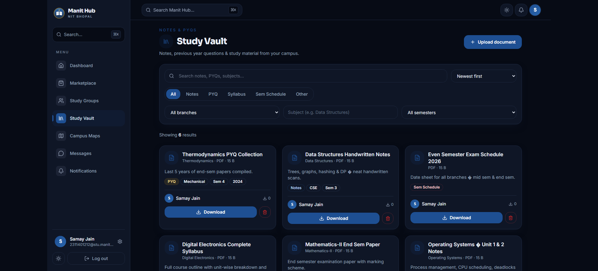 | |

</div>

**🔗 Live web app:** https://manithub-samayjainbm.netlify.app/
**🔌 API base URL:** `https://manithub-backend.vercel.app/api`

<details>
<summary><b>Example API response</b> — <code>POST /api/auth/login</code></summary>

```json
{
  "success": true,
  "message": "Success",
  "data": {
    "user": {
      "id": "6a0cb1909d5806fe5529ebaf",
      "displayName": "Samay Jain",
      "email": "2311401212@stu.manit.ac.in",
      "university": { "_id": "6a0cb190…", "name": "MANIT" }
    },
    "token": "eyJhbGciOiJIUzI1NiIsInR5cCI6IkpXVCJ9…"
  }
}
```

</details>

---

## 📑 Table of Contents

- [✨ Features](#-features)
- [🧰 Tech Stack](#-tech-stack)
- [🏗️ Architecture](#️-architecture)
  - [System Overview](#system-overview)
  - [Folder Structure](#folder-structure)
  - [Request & Data Flow](#request--data-flow)
  - [Data Model](#data-model)
- [🚀 Getting Started](#-getting-started)
- [🔑 Environment Variables](#-environment-variables)
- [🌱 Seeding Demo Data](#-seeding-demo-data)
- [📱 Mobile App (Android)](#-mobile-app-android)
- [🔌 API Reference](#-api-reference)
- [☁️ Deployment](#️-deployment)
- [🗺️ Roadmap](#️-roadmap)
- [🤝 Contributing](#-contributing)
- [📄 License](#-license)

---

## ✨ Features

| | Feature | What it does | Why it matters |
| :-- | :-- | :-- | :-- |
| 🔐 | **University‑scoped auth** | Sign up with your `@stu.manit.ac.in` email; JWT sessions with password reset. | A **verified, students‑only** community — every account is a real campus identity. |
| 🛒 | **Student Marketplace** | List, search, filter & sort items across 6 categories with condition badges, Cloudinary photos, wishlist and "mark sold". | Buy & sell textbooks, cycles and hostel gear **safely within campus** — settle over UPI. |
| 👥 | **Study Groups** | Create or join branch‑wise groups with tags, member caps, scheduled sessions and WhatsApp/Telegram/Discord/Meet links. | Find your people and **organise revision** without scattering across 5 apps. |
| 📚 | **Study Vault** | Upload, search & download notes, PYQs, syllabi and schedules — filtered by branch, subject, semester and type, with download counts. | The campus knowledge base: **exam prep material in one place**, shared by the students who aced it. |
| 💬 | **Real‑time Chat** | Socket.IO conversations tied to listings, with read receipts and unread counts. | Reach a seller or group‑mate **instantly**, with context attached. |
| 🔔 | **Event‑driven Notifications** | Auto‑generated on new message, group join, or interest in your listing — grouped & filterable. | Never miss a reply or a buyer — **the bell reflects real activity**. |
| 🗺️ | **Campus Maps** | 41 real MANIT locations — all 12 hostels, canteens, sports grounds and departments — opened in an embedded live map. | Navigate a sprawling campus by **name, category, or exact pin**. |
| ⚙️ | **Rich Settings** | Profile + avatar upload, UPI payment QR, notification preferences and privacy controls. | Control your identity, payments and visibility **from one place**. |
| 🎨 | **Premium Design System** | MANIT navy/crimson/gold tokens, full **dark mode**, and a **⌘K command palette**. | Feels like a flagship product, not a college portal. |
| 📱 | **Native Android App** | The same app shipped via **Capacitor** — offline‑bundled fonts, theme‑aware status bar, signed APK/AAB. | One codebase, **web + Play‑Store‑ready Android**. |
| 🏛️ | **Multi‑tenant by University** | Every listing, group and message is scoped to the user's university via middleware. | Clean **data isolation** — ready to expand beyond a single campus. |

---

## 🧰 Tech Stack

| Layer | Technologies |
| :-- | :-- |
| **Frontend** | React 19, Vite 7, Tailwind CSS 3, Framer Motion, React Router 7, Axios, Lucide Icons, `@fontsource` |
| **Realtime** | Socket.IO (client + server) |
| **Backend** | Node.js, Express 5, Mongoose 9, JSON Web Tokens, bcryptjs, Helmet, CORS, node‑cron |
| **Database** | MongoDB (Atlas) |
| **Media** | Cloudinary (via Multer) |
| **Mobile** | Capacitor 8 (Android) — App, Status Bar, Splash Screen, native HTTP |
| **Tooling** | ESLint, PostCSS, Autoprefixer, clsx + tailwind‑merge |
| **Hosting** | Netlify (web) · Vercel (API) · MongoDB Atlas (DB) |

---

## 🏗️ Architecture

### System Overview

Manit Hub is a **monorepo** with a decoupled SPA/native client and a REST + WebSocket API. All data is **scoped per university** by JWT‑embedded claims, enforced by middleware.

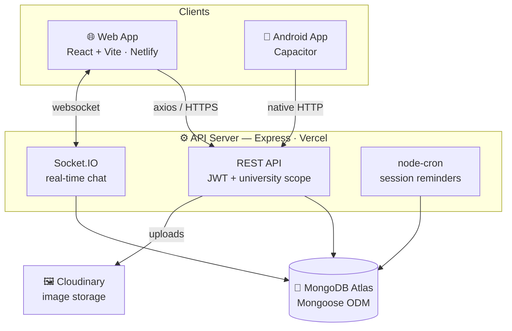

### Folder Structure

```
manit-hub/
├── frontend/                  # React + Vite SPA  (also the Capacitor Android shell)
│   ├── src/
│   │   ├── api/               # Axios clients (auth, listings, studyGroups, messages…)
│   │   ├── components/        # UI kit, nav, command palette, feature components
│   │   ├── context/           # Auth + Theme providers
│   │   ├── hooks/             # useAuth, useUnreadCount
│   │   ├── layouts/           # AppLayout (sidebar + topbar shell)
│   │   ├── lib/               # cn(), inline image fallbacks
│   │   ├── pages/             # Route-level screens
│   │   └── utils/             # Socket.IO service
│   ├── android/               # Capacitor Android project (Gradle)
│   ├── scripts/               # App-icon generator
│   └── capacitor.config.json
│
├── backend/                   # Express REST + Socket.IO API
│   ├── src/
│   │   ├── config/            # db (Mongo), cloudinary
│   │   ├── controllers/       # auth, listings, studyGroups, documents, messages, notifications…
│   │   ├── middleware/        # auth (JWT), universityScope, uploads, error handler
│   │   ├── models/            # User, University, Listing, StudyGroup, Document, Conversation, Message, Notification
│   │   ├── routes/            # /api/* route definitions
│   │   ├── socket/            # chat.socket.js (real-time events)
│   │   ├── jobs/              # studyGroupReminder cron job
│   │   └── utils/             # jwt, unified response helper
│   └── scripts/seed.js        # Demo data seeder
│
└── README.md
```

### Request & Data Flow

A typical authenticated request — every read/write is filtered to the caller's university.

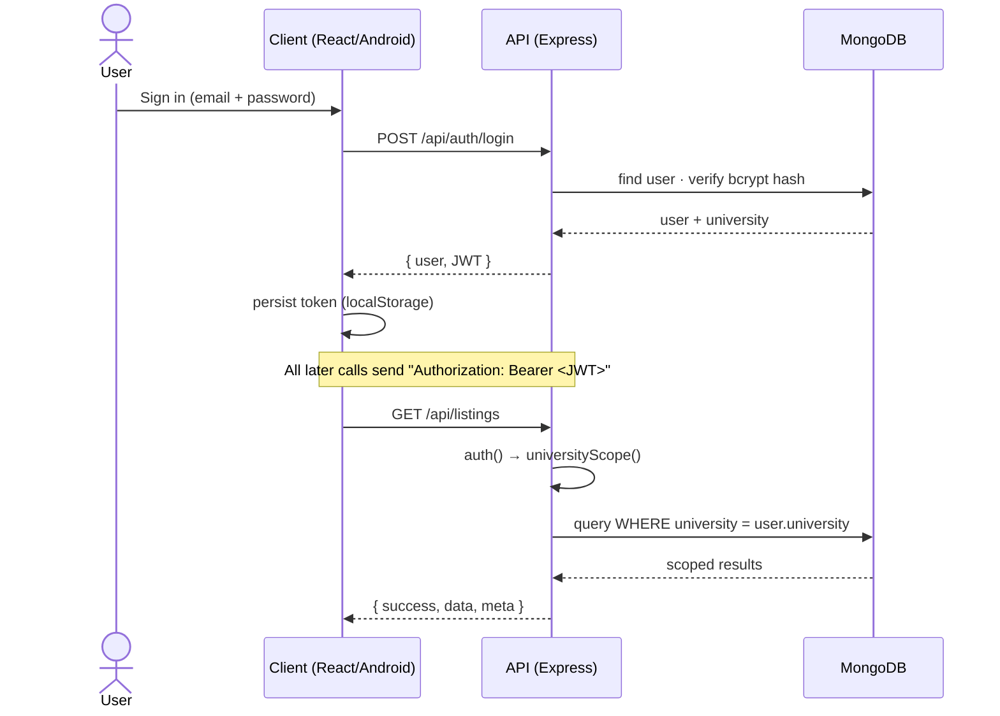

### Data Model

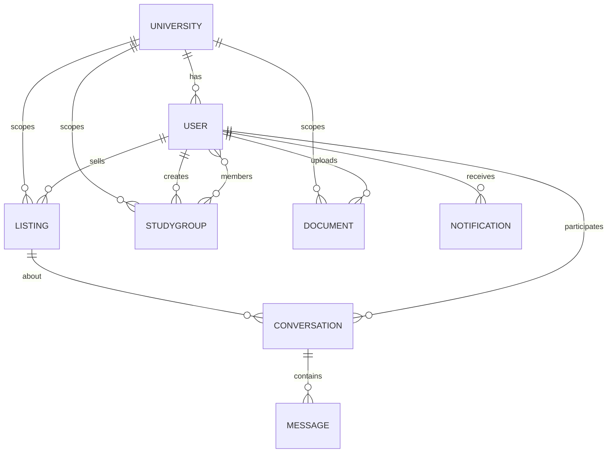

---

## 🚀 Getting Started

### Prerequisites

- **Node.js** ≥ 18 and npm
- A **MongoDB** connection string (e.g. [MongoDB Atlas](https://www.mongodb.com/atlas))
- *(optional)* a **Cloudinary** account for image uploads
- *(optional, for the Android app)* **Android Studio** + JDK 21

### 1. Clone

```bash
git clone https://github.com/Samay-Jain/Manit-Hub.git
cd Manit-Hub
```

### 2. Backend

```bash
cd backend
cp .env.example .env          # then fill in MONGO_URI, JWT_SECRET, …
npm install
npm run seed                  # (optional) load demo data
npm run dev                   # starts the API on http://localhost:5001
```

### 3. Frontend

```bash
cd ../frontend
cp .env.example .env          # defaults work out of the box via the dev proxy
npm install
npm run dev                   # starts the web app on http://localhost:5173
```

Open **http://localhost:5173** and sign up with an `@stu.manit.ac.in` email. 🎉

> The Vite dev server proxies `/api` to the backend, so there are **no CORS headaches** locally.

---

## 🔑 Environment Variables

### `backend/.env`

| Variable | Required | Description |
| :-- | :--: | :-- |
| `MONGO_URI` | ✅ | MongoDB connection string (Atlas recommended) |
| `JWT_SECRET` | ✅ | Long random string used to sign JWTs |
| `CLIENT_URL` | ⬜ | Allowed CORS origin(s), comma‑separated (`*.netlify.app` / `*.vercel.app` & localhost are auto‑allowed) |
| `PORT` | ⬜ | API port (default `5001`) |
| `NODE_ENV` | ⬜ | `development` or `production` |
| `CLOUDINARY_CLOUD_NAME` / `CLOUDINARY_API_KEY` / `CLOUDINARY_API_SECRET` | ⬜ | Needed for image/avatar uploads |

### `frontend/.env`

| Variable | Required | Description |
| :-- | :--: | :-- |
| `VITE_API_URL` | ⬜ | Explicit backend URL. Leave unset in dev to use the Vite proxy |
| `VITE_PROXY_TARGET` | ⬜ | Where the dev proxy forwards `/api` (defaults to the hosted backend) |
| `VITE_SOCKET_URL` | ⬜ | Socket.IO server URL |

---

## 🌱 Seeding Demo Data

Populate the marketplace, study groups, conversations and notifications with realistic MANIT‑themed data:

```bash
cd backend
npm run seed
```

Creates demo students (e.g. `aarav.demo@stu.manit.ac.in` / `password123`), 12 listings, 7 study groups, and private conversations + notifications for the configured primary user. Safe to re‑run — it resets only its own demo data.

---

## 📱 Mobile App (Android)

The web app is wrapped as a **native Android app** with [Capacitor](https://capacitorjs.com/). Native HTTP is enabled, so the app talks to the API with no extra CORS configuration.

```bash
cd frontend
npm run android          # build web → sync → open in Android Studio
npm run android:icons    # (re)generate launcher icons & splash from the MANIT crest
```

| Command | Action |
| :-- | :-- |
| `npm run cap:sync` | Rebuild the web app and copy it into the Android project |
| `npm run android` | Build, sync, and open Android Studio |
| `gradlew assembleDebug` | Build a debug APK → `android/app/build/outputs/apk/debug/` |
| `gradlew assembleRelease bundleRelease` | Build a **signed** APK + AAB for the Play Store |

> **Note:** Capacitor 8 requires **JDK 21** (Android Studio bundles it). Release signing reads from `android/keystore.properties` — keep your keystore safe and **never commit it** (it's git‑ignored).

---

## 🔌 API Reference

All endpoints are prefixed with `/api`. Protected routes require `Authorization: Bearer <token>` and are scoped to the user's university.

| Method | Endpoint | Description |
| :-- | :-- | :-- |
| `POST` | `/auth/signup` · `/auth/login` | Register / authenticate |
| `POST` | `/auth/forgot-password` · `/auth/reset-password` | Password recovery |
| `GET` `POST` `PUT` `DELETE` | `/listings` `…/:id` | Marketplace CRUD, status & images |
| `GET` `POST` | `/study-groups` `…/:id/join` `…/:id/leave` | Study groups CRUD & membership |
| `GET` `POST` `DELETE` | `/documents` `…/:id/download` | Study Vault: upload, list/filter, track downloads, delete own |
| `GET` `POST` | `/conversations` | Start / list conversations |
| `GET` `PUT` | `/messages/:conversationId` | Fetch & mark messages read *(send is via Socket.IO)* |
| `GET` `PUT` `DELETE` | `/notifications` | List, mark read, delete |
| `GET` `PUT` | `/users/me` · `/users/avatar` · `/users/settings` | Profile, avatar & settings |
| `GET` | `/dashboard/summary` | Dashboard aggregates |
| `GET` | `/health` | Health check |

**Realtime (Socket.IO):** `join_conversation`, `send_message`, `mark_read` → broadcasts `receive_message`, `messages_read`.

---

## ☁️ Deployment

| Component | Platform | Notes |
| :-- | :-- | :-- |
| **Web** | Netlify | `npm run build` → publish `frontend/dist` (SPA redirect to `/index.html`) |
| **API** | Vercel | Express app; set env vars in the dashboard |
| **Database** | MongoDB Atlas | Whitelist your hosts |
| **Android** | Google Play | Upload the signed `.aab` |

> ℹ️ **Live chat note:** Socket.IO needs a persistent (non‑serverless) host. REST works everywhere; for production websockets, run the API on a long‑lived host (Render/Railway/Fly).

---

## 🗺️ Roadmap

- [ ] Push notifications (FCM)
- [ ] Lost & Found and Events modules
- [ ] In‑app UPI deep links for checkout
- [ ] iOS build via Capacitor
- [ ] Admin moderation dashboard
- [ ] Expand multi‑tenant support to more NITs

---

## 🤝 Contributing

Contributions are welcome!

1. Fork the repo & create a branch: `git checkout -b feat/amazing-thing`
2. Commit your changes: `git commit -m "feat: add amazing thing"`
3. Run `npm run lint` (frontend) and make sure the build passes
4. Push and open a Pull Request

Please keep PRs focused and describe the change clearly.

---

## 📄 License

Distributed under the **MIT License**. Add a [`LICENSE`](LICENSE) file at the repo root if one isn't present.

---

<div align="center">

**Manit Hub** — built by students, for students. 🎓
<br/>
<sub>Not an official institute portal. For official notices, visit <a href="https://www.manit.ac.in/">manit.ac.in</a>.</sub>

</div>
