<div align="center">


# Manit Hub

### The student super‑app for MANIT Bhopal — marketplace, study vault, CGPA & attendance trackers, confessions, events, ride‑share, Q&A, real‑time chat & campus maps, in one place.

Manit Hub brings campus life at **Maulana Azad National Institute of Technology (NIT Bhopal)** into a single, premium experience.
Built by students, for students — a verified, university‑scoped community on the **web** and as a native **Android** app.

<br/>

[](LICENSE)
[](https://github.com/Samay-Jain/Manit-Hub/stargazers)
[](https://github.com/Samay-Jain/Manit-Hub/network/members)
[](https://github.com/Samay-Jain/Manit-Hub/issues)
[](https://github.com/Samay-Jain/Manit-Hub/commits)

<br/>


<br/>

[**🌐 Live Demo**](https://manithub-samayjainbm.vercel.app/) · [**▶️ Video Tour**](https://youtu.be/4ngVWX2E0rU) · [**📱 Android App**](#-mobile-app-android) · [**🐛 Report Bug**](https://github.com/Samay-Jain/Manit-Hub/issues) · [**✨ Request Feature**](https://github.com/Samay-Jain/Manit-Hub/issues)

</div>

---

## 🎬 Demo

<div align="center">

<a href="https://youtu.be/4ngVWX2E0rU">
  
</a>

<sub>▶️ Click to watch the full video tour on YouTube</sub>

</div>

<div align="center">

| Landing | Login | Dashboard |
| :---: | :---: | :---: |
|  |  |  |
| **CGPA Tracker** | **Attendance** | **Timetable** |
| 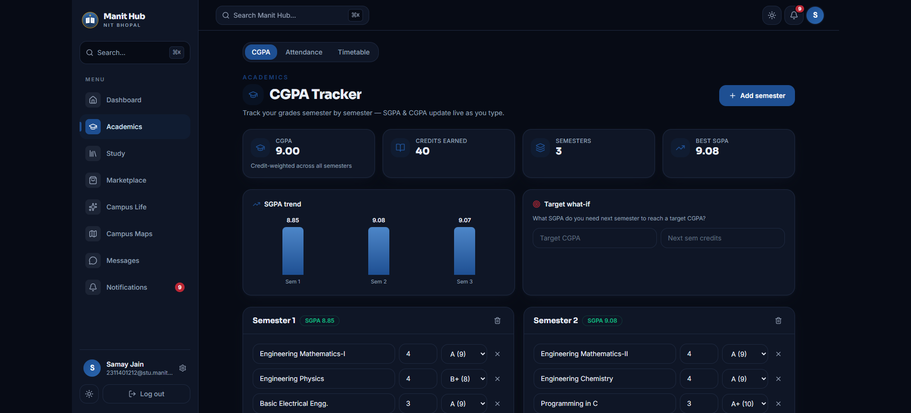 | 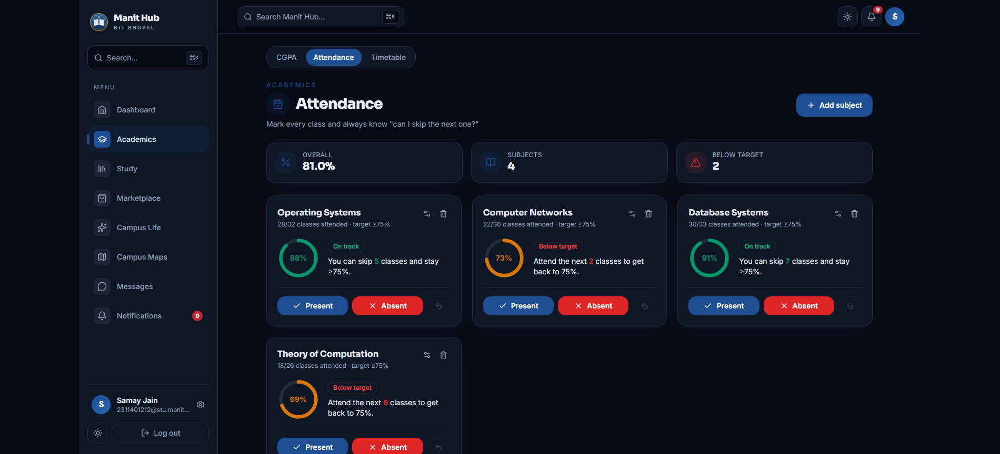 | 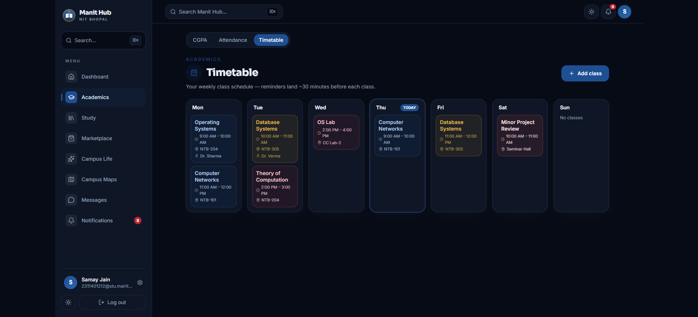 |
| **Study Vault** | **Course Q&A** | **Study Groups** |
|  | 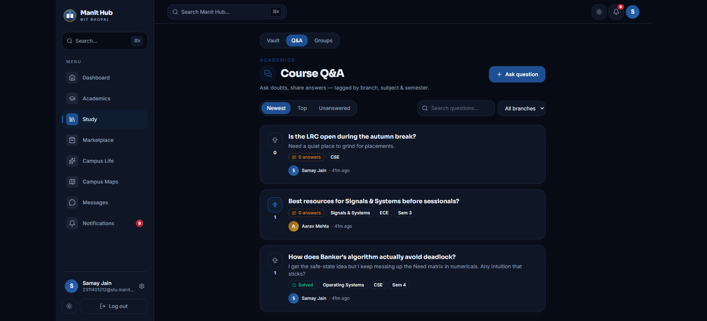 |  |
| **Marketplace** | **Offers** | **Confessions** |
|  | 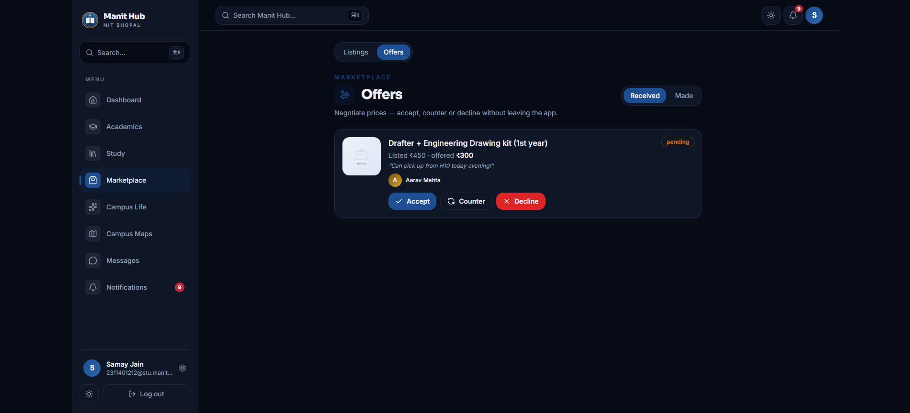 | 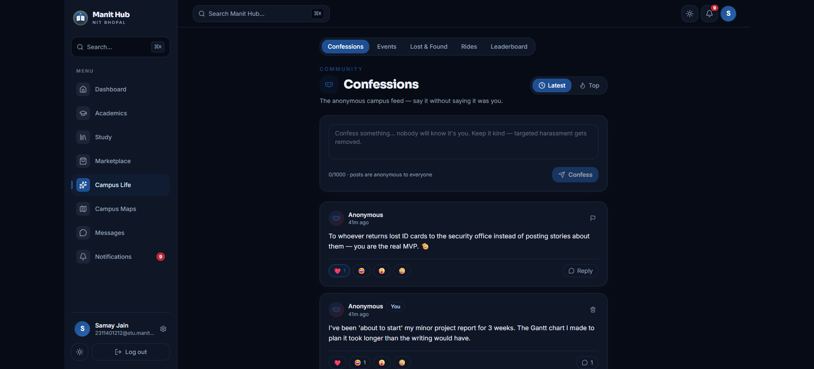 |
| **Events & Clubs** | **Lost & Found** | **Ride Share** |
| 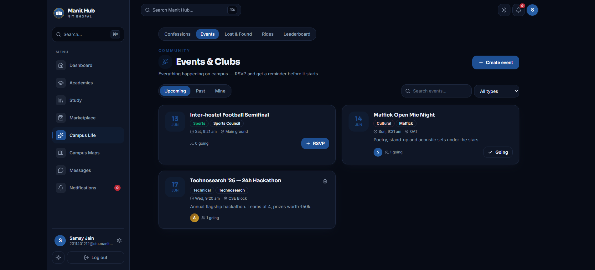 | 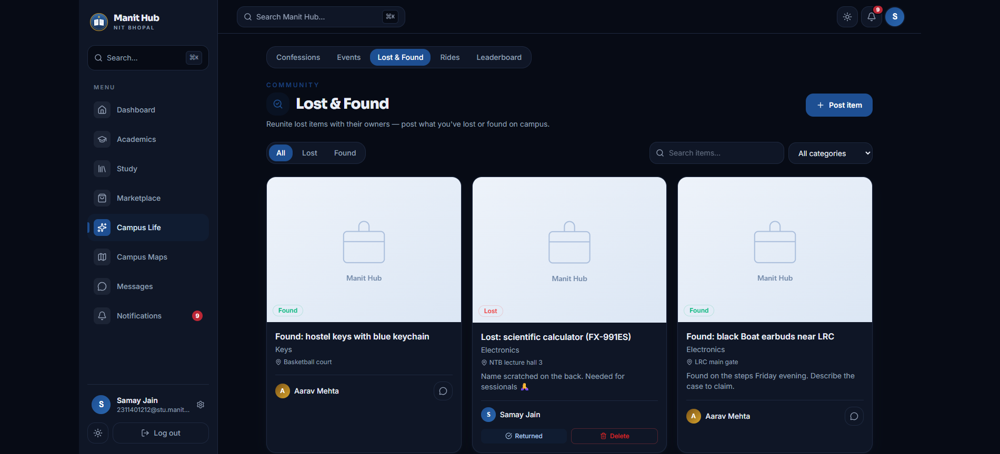 | 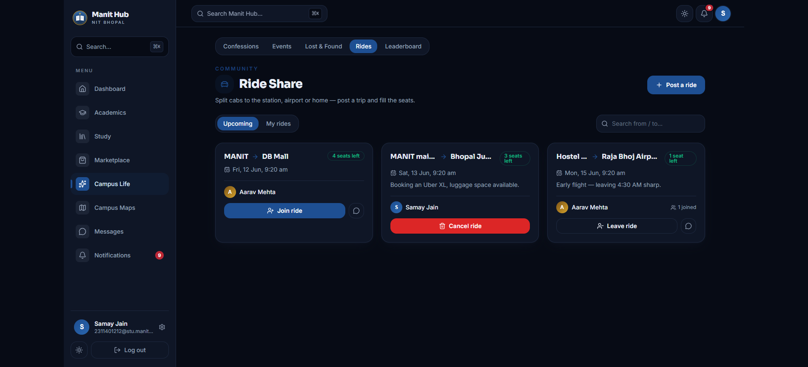 |
| **Campus Maps** | **Real-time Chat** | **Notifications** |
|  |  | 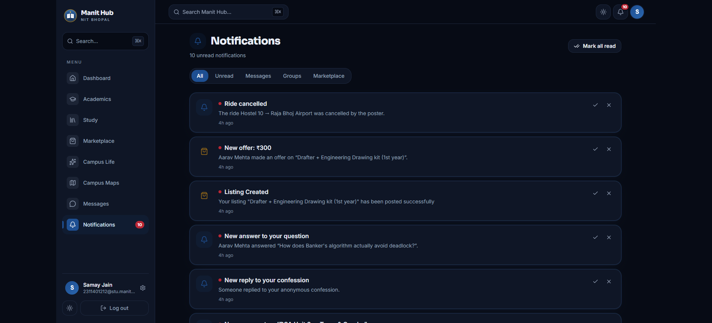 |

</div>

**🔗 Live web app:** https://manithub-samayjainbm.vercel.app/
**🔌 API base URL:** `https://manit-hub.onrender.com/api`

<details>
<summary><b>Example API response</b> — <code>POST /api/auth/login</code></summary>

```json
{
  "success": true,
  "message": "Success",
  "data": {
    "user": {
      "id": "6a0cb1909d5806fe5529ebaf",
      "displayName": "Samay Jain",
      "email": "2311401212@stu.manit.ac.in",
      "university": { "_id": "6a0cb190…", "name": "MANIT" }
    },
    "token": "eyJhbGciOiJIUzI1NiIsInR5cCI6IkpXVCJ9…"
  }
}
```

</details>

---

## 📑 Table of Contents

- [✨ Features](#-features)
- [🧰 Tech Stack](#-tech-stack)
- [🏗️ Architecture](#️-architecture)
  - [System Overview](#system-overview)
  - [Folder Structure](#folder-structure)
  - [Request & Data Flow](#request--data-flow)
  - [Data Model](#data-model)
- [🔒 Security & Moderation](#-security--moderation)
- [📚 Project Documentation](#-project-documentation)
- [🚀 Getting Started](#-getting-started)
- [🔑 Environment Variables](#-environment-variables)
- [🌱 Seeding Demo Data](#-seeding-demo-data)
- [📱 Mobile App (Android)](#-mobile-app-android)
- [🔌 API Reference](#-api-reference)
- [☁️ Deployment](#️-deployment)
- [🗺️ Roadmap](#️-roadmap)
- [🤝 Contributing](#-contributing)
- [📄 License](#-license)

---

## ✨ Features

| | Feature | What it does | Why it matters |
| :-- | :-- | :-- | :-- |
| 🔐 | **University‑scoped auth** | Sign up with your `@stu.manit.ac.in` email; long‑lived JWT sessions that **persist across app/browser restarts** (durable native storage on Android) with password reset. | A **verified, students‑only** community — every account is a real campus identity, and you stay signed in until you log out. |
| 🛒 | **Student Marketplace** | List, search, filter & sort items across 6 categories with condition badges, Cloudinary photos, wishlist and "mark sold". | Buy & sell textbooks, cycles and hostel gear **safely within campus** — settle over UPI. |
| 👥 | **Study Groups** | Create or join branch‑wise groups with tags, member caps, scheduled sessions and WhatsApp/Telegram/Discord/Meet links. | Find your people and **organise revision** without scattering across 5 apps. |
| 📚 | **Study Vault** | Upload, search & download notes, PYQs, syllabi and schedules — filtered by branch, subject, semester and type, with download counts, **in‑app PDF/image preview, upvotes & comments**. | The campus knowledge base: **exam prep material in one place** — and the best notes float to the top. |
| 🎓 | **CGPA Tracker** | Per‑semester subject/credit/grade entry with live SGPA & CGPA, an SGPA trend chart and a target‑CGPA "what‑if" calculator. | Know exactly **what SGPA you need next semester** — before the semester. |
| ✅ | **Attendance Tracker** | Mark present/absent per subject, see your %, and get the answer to "**can I skip the next class?**" against your ≥75% target. | Skip strategically, never fall below the **detained line**. |
| 🗓️ | **Personal Timetable** | Weekly class grid with rooms & professors, color‑coded by subject — plus **automatic reminders ~30 min before class** via cron. | Your schedule remembers itself. |
| 🤫 | **Confessions** | Fully anonymous campus feed with reactions, anonymous threaded replies (`OP` / `Anon-XXXX` handles), reporting and auto‑hide moderation. | Say it **without saying it was you** — with guardrails. |
| 🧭 | **Lost & Found** | Post lost/found items with photos, category & location; mark them returned; message the poster in chat. | Reunite lost ID cards, earbuds and keys **without 50 WhatsApp groups**. |
| 🎉 | **Events & Clubs** | Clubs publish events with venue & category; students RSVP and get a **reminder before it starts**. | The whole campus calendar, **one tap from RSVP**. |
| ❓ | **Course Q&A Forum** | StackOverflow‑style questions tagged by branch/subject/semester, with upvotes and **accepted answers**. | Doubts get answered **by people who took the same exam**. |
| 🚕 | **Ride Share** | Post a trip (from/to/time/seats), others book a seat and coordinate in chat; poster can cancel with notifications. | **Split cabs** to the station and airport painlessly. |
| 💸 | **UPI Checkout** | `upi://` deep link + auto‑generated QR from the seller's saved UPI ID, prefilled with the listing price. | Pay in two taps — **no payment handles in chat**. |
| 🤝 | **Offers & Negotiation** | Buyers make offers; sellers **accept / counter / decline** with notifications at every step; accepted offers reserve the listing. | Haggle like the campus market demands — **in the app, on the record**. |
| 🚩 | **Reports & Moderation** | Report any listing/doc/confession/question; admins get a review queue to **remove content or dismiss** (auto‑resolves duplicates). | User‑generated content **stays safe at scale**. |
| 🛡️ | **Admin Console** | An `isAdmin`‑gated console — platform analytics (users, marketplace, engagement & moderation KPIs), growth + breakdown charts, a searchable account list, per‑user detail, and reversible **suspend / unsuspend**. Reached through the **normal login** (no separate admin credentials). | Moderators get a **cockpit** to see and steer the whole platform. |
| 🏆 | **Gamification** | Karma points for uploads, answers, listings & more; milestone badges and a campus **leaderboard**. | Contributing to campus **feels like winning**. |
| 👤 | **Rich Profiles** | Reputation (points, level, badges, verified mark) + contribution history across docs, Q&A, events and rides. | Your campus identity is **more than a username**. |
| 📲 | **Push Notifications (FCM)** | Every in‑app notification mirrors to **web & Android push** via Firebase Cloud Messaging (config‑gated). | Replies, offers and reminders reach you **even with the app closed**. |
| 💬 | **Real‑time Chat** | Socket.IO conversations tied to listings, with read receipts and unread counts. | Reach a seller or group‑mate **instantly**, with context attached. |
| 🔔 | **Event‑driven Notifications** | Auto‑generated on new message, group join, or interest in your listing — grouped & filterable. | Never miss a reply or a buyer — **the bell reflects real activity**. |
| 🗺️ | **Campus Maps** | 41 real MANIT locations — all 12 hostels, canteens, sports grounds and departments — opened in an embedded live map. | Navigate a sprawling campus by **name, category, or exact pin**. |
| ⚙️ | **Rich Settings** | Profile + avatar upload, UPI payment QR, notification preferences and privacy controls. | Control your identity, payments and visibility **from one place**. |
| 🎨 | **Premium Design System** | MANIT navy/crimson/gold tokens, full **dark mode**, a **⌘K command palette**, and a clean 8‑item **hub navigation** (Academics · Study · Marketplace · Campus Life) with in‑page tabs. | Feels like a flagship product, not a college portal. |
| 📱 | **Native Android App** | The same app shipped via **Capacitor** — offline‑bundled fonts, theme‑aware status bar, signed APK/AAB. | One codebase, **web + Play‑Store‑ready Android**. |
| 🏛️ | **Multi‑tenant by University** | Every listing, group and message is scoped to the user's university via middleware. | Clean **data isolation** — ready to expand beyond a single campus. |

---

## 🧰 Tech Stack

| Layer | Technologies |
| :-- | :-- |
| **Frontend** | React 19, Vite 7, Tailwind CSS 3, Framer Motion, React Router 7, Axios, Lucide Icons, `@fontsource` |
| **Realtime** | Socket.IO (client + server) |
| **Backend** | Node.js, Express 5, Mongoose 9, JSON Web Tokens, bcryptjs, Helmet, CORS, node‑cron, Firebase Admin (FCM) |
| **Database** | MongoDB (Atlas) |
| **Media** | Cloudinary (via Multer) |
| **Push & QR** | Firebase Cloud Messaging (web + Android) · `qrcode` (UPI QR generation) |
| **Mobile** | Capacitor 8 (Android) — App, Status Bar, Splash Screen, native HTTP |
| **Tooling** | ESLint, PostCSS, Autoprefixer, clsx + tailwind‑merge |
| **Hosting** | Vercel (web) · Render (API) · MongoDB Atlas (DB) |

---

## 🏗️ Architecture

### System Overview

Manit Hub is a **monorepo** with a decoupled SPA/native client and a REST + WebSocket API. All data is **scoped per university** by JWT‑embedded claims, enforced by middleware.

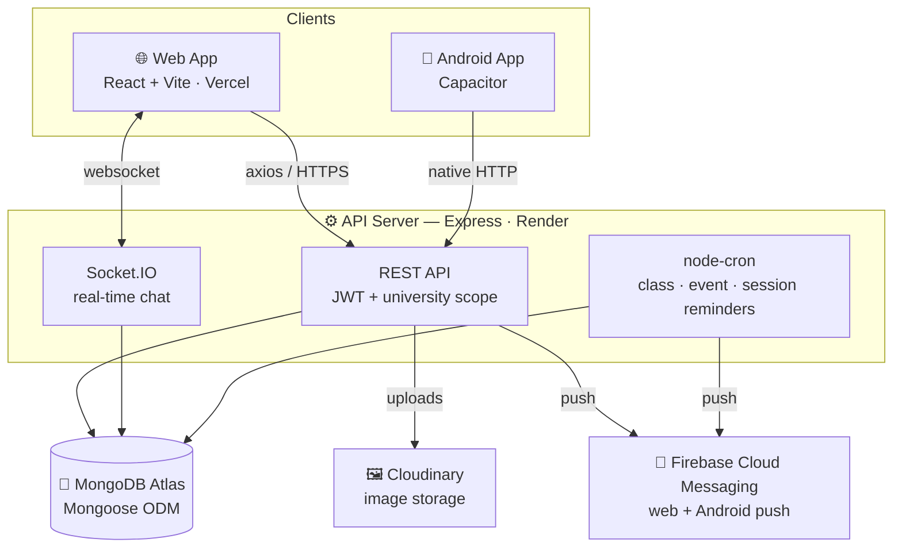

### Folder Structure

```
manit-hub/
├── frontend/                  # React + Vite SPA  (also the Capacitor Android shell)
│   ├── src/
│   │   ├── api/               # Axios clients (auth, listings, studyGroups, messages…)
│   │   ├── components/        # UI kit (ui/, brand/), nav, command palette, feature components
│   │   ├── context/           # Auth + Theme providers
│   │   ├── hooks/             # useAuth, useUnreadCount
│   │   ├── layouts/           # AppLayout (sidebar + topbar shell)
│   │   ├── lib/               # cn(), inline image fallbacks
│   │   ├── screens/           # Route-level screens (one per route)
│   │   └── utils/             # Socket.IO service, durable auth storage (Preferences + localStorage)
│   ├── android/               # Capacitor Android project (Gradle)
│   ├── scripts/               # App-icon generator
│   └── capacitor.config.json
│
├── backend/                   # Express REST + Socket.IO API — one .js file per endpoint
│   ├── app.js                 # Express app — mounts one router per endpoint
│   ├── server.js              # HTTP + Socket.IO bootstrap
│   ├── config/                # db (Mongo), cloudinary, firebase
│   ├── middleware/            # auth (JWT), universityScope, uploads, isAdmin, error handler
│   ├── models/                # User, Listing, StudyGroup, Document, Confession, Event, Ride, Question/Answer, Offer, Report, …
│   ├── utils/                 # jwt, response, gamification + shared notifications/universities helpers
│   ├── socket/                # chat.socket.js (real-time events)
│   ├── jobs/                  # studyGroup / class / event reminder cron jobs
│   ├── apis/                  # 24 feature folders, one .js file per endpoint —
│   │                          #   auth · admin · users · universities · listings · conversations ·
│   │                          #   messages · studyGroups · notifications · dashboard · documents ·
│   │                          #   academicRecords · attendance · lostFound · confessions · rides ·
│   │                          #   timetable · events · forum · offers · reports · leaderboard ·
│   │                          #   push · friends   (shared bits in apis/<feature>/helpers.js)
│   └── scripts/seed.js        # Demo data seeder
│
└── README.md
```

### Request & Data Flow

A typical authenticated request — every read/write is filtered to the caller's university.

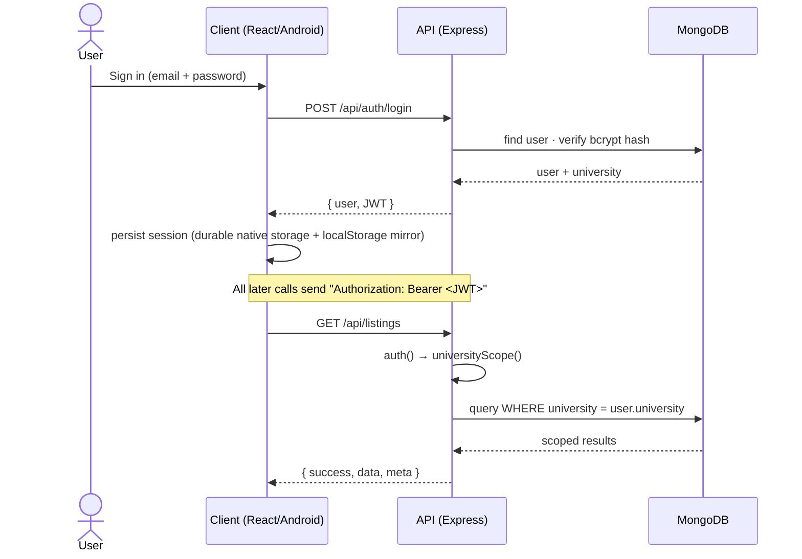

### Data Model

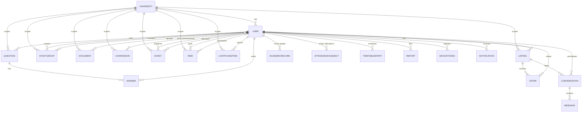

---

## 🔒 Security & Moderation

Manit Hub is built **defence-in-depth** — no single control is trusted alone. Highlights:

| Area | What's in place |
| :-- | :-- |
| **Passwords** | bcrypt (salted, cost 10), `select:false`; minimum 8 characters |
| **Sessions** | JWTs carry a `tokenVersion` claim — a password reset increments it and **instantly revokes every old token** (revoke-on-compromise without giving up long, friction-free sessions) |
| **Account verification** | Only `@stu.manit.ac.in` scholar emails are accepted (model + every auth route); with SMTP set, signup requires a **6-digit email code** (stored SHA-256-hashed, 30-min expiry) to prove ownership |
| **Rate limiting** | `express-rate-limit`: 600 req/15 min per IP across the API, and **20 failed attempts/15 min** on auth routes (successful logins aren't counted) — stops brute force, signup spam and code guessing |
| **Password reset** | Random token, **only its SHA-256 hash stored** (30-min expiry), emailed via Nodemailer; token returned in the response **only** in dev when no SMTP is configured |
| **Multi-tenancy** | Every read/write is scoped to `req.user.university`; `universityScope` guards `:id` routes; the socket layer re-checks tenant before join/send |
| **CORS** | Exact origin allow-list; preview deploys matched on the **full project slug** as a subdomain label (no loose substring that a `manithub-*.vercel.app` could forge); Socket.IO shares the same policy |
| **Mass assignment** | Write handlers copy an explicit **field whitelist** — `seller`/`university`/`isActive` can't be set from the request body |
| **Uploads** | Raster-only MIME allow-list (**SVG rejected** — it can carry XSS), size caps, per-listing image count cap |
| **Privacy** | `private` profiles are hidden; phone numbers are shown only to the user and accepted friends (no harvesting) |
| **Error handling** | 500-level errors return a generic message in production (no internal detail leaks) |

**Content moderation** runs in three layers:

1. **Text filter** — a self-contained English + Hindi/Hinglish profanity filter (de-obfuscates leetspeak, spacing and repeats, whole-word matching to avoid false positives) rejects abusive text in confessions, forum and listings. Extend it at runtime with `EXTRA_BLOCKED_WORDS`.
2. **Report → auto-hide → strikes → ban** — content auto-hides after `AUTO_HIDE_REPORTS` distinct reports; the author gets a strike; `AUTO_BAN_STRIKES` strikes auto-suspends the account (blocked at login, API and socket). Admins keep a manual review queue.
3. **Image moderation** — an **env-gated** hook (Google Cloud Vision SafeSearch or Sightengine) rejects adult/explicit images **before they're stored**. Off by default (uploads allowed) until you set a provider key; fails open on a provider outage so the report queue remains the backstop.

> 📄 A full **why / how / why-this-not-that** write-up of every control lives in [`docs/Manit-Hub-Developer-Notes.pdf`](docs/Manit-Hub-Developer-Notes.pdf) → *Section 16 · Security hardening & content moderation*.

---

## 📚 Project Documentation

Five deep-dive documents live in [`docs/`](docs/) — each a self-contained HTML source rendered to a print-ready PDF:

| Document | What it is | Pages |
| :-- | :-- | :--: |
| 📘 [**Developer Study Guide**](docs/Manit-Hub-Developer-Notes.pdf) | Interview-grade reference — every endpoint, library and design decision, with a function-by-function appendix. | ~88 |
| 🗄️ [**Database Schema Reference**](docs/Manit-Hub-Database-Schema.pdf) | A compact data dictionary of all 21 collections — every field, index, hook and relationship. | ~11 |
| 📖 [**The Build Story**](docs/Manit-Hub-Build-Story.pdf) | The narrative dev history — decisions, war stories and the bugs that shipped, told chronologically. | ~21 |
| 🎓 [**SD3 Project Viva — 110 Q&A**](docs/Manit-Hub-SD3-Viva-Questions.pdf) | A graded question bank (**Easy → Hardest**) with model answers and “why this, not that” justifications, plus 10 implementation & content-moderation judgment questions. | ~18 |
| 🧰 [**Tech Stack & Dependency Inventory**](docs/Manit-Hub-Tech-Stack-Inventory.pdf) | Every library, plugin, service and tool with versions and the reason it's there — plus an honest “gaps & dead weight” section. | ~7 |

> The reusable prompts that generate these live in [`docs/PDF-Generation-Prompts.md`](docs/PDF-Generation-Prompts.md).

---

## 🚀 Getting Started

### Prerequisites

- **Node.js** ≥ 18 and npm
- A **MongoDB** connection string (e.g. [MongoDB Atlas](https://www.mongodb.com/atlas))
- *(optional)* a **Cloudinary** account for image uploads
- *(optional, for the Android app)* **Android Studio** + JDK 21

### 1. Clone

```bash
git clone https://github.com/Samay-Jain/Manit-Hub.git
cd Manit-Hub
```

### 2. Backend

```bash
cd backend
cp .env.example .env          # then fill in MONGO_URI, JWT_SECRET, …
npm install
npm run seed                  # (optional) load demo data
npm run dev                   # starts the API on http://localhost:5001
```

### 3. Frontend

```bash
cd ../frontend
cp .env.example .env          # defaults work out of the box via the dev proxy
npm install
npm run dev                   # starts the web app on http://localhost:5173
```

Open **http://localhost:5173** and sign up with an `@stu.manit.ac.in` email. 🎉

> The Vite dev server proxies `/api` to the backend, so there are **no CORS headaches** locally.

---

## 🔑 Environment Variables

### `backend/.env`

| Variable | Required | Description |
| :-- | :--: | :-- |
| `MONGO_URI` | ✅ | MongoDB connection string (Atlas recommended) |
| `JWT_SECRET` | ✅ | Long random string used to sign JWTs |
| `JWT_EXPIRE` | ⬜ | Session lifetime (default `365d`) |
| `CLIENT_URL` | ⬜ | Allowed CORS origin(s), comma‑separated. Localhost dev origins and this project's own `*.vercel.app` / `*.netlify.app` preview subdomains (matched on the full project slug) are also allowed |
| `DEPLOY_SLUGS` | ⬜ | Project slug(s) whose preview subdomains are CORS‑allowed (default `manithub-samayjainbm`) |
| `PORT` | ⬜ | API port (default `5001`) |
| `NODE_ENV` | ⬜ | `development` or `production` |
| `CLOUDINARY_CLOUD_NAME` / `CLOUDINARY_API_KEY` / `CLOUDINARY_API_SECRET` | ⬜ | Needed for image/avatar uploads |
| `FIREBASE_SERVICE_ACCOUNT` | ⬜ | Firebase service-account JSON (raw or base64) — enables FCM push; in-app notifications work without it |
| `SMTP_HOST` / `SMTP_PORT` / `SMTP_USER` / `SMTP_PASS` / `EMAIL_FROM` | ⬜ | Outbound email. When set, signup requires email verification and password‑reset links are emailed; when unset, both fall back to dev behaviour |
| `EXTRA_BLOCKED_WORDS` | ⬜ | Extra comma‑separated words for the profanity filter |
| `AUTO_HIDE_REPORTS` / `AUTO_BAN_STRIKES` | ⬜ | Moderation thresholds (defaults `3` / `3`) |
| `IMAGE_MODERATION_PROVIDER` + `GOOGLE_VISION_API_KEY` *or* `SIGHTENGINE_USER`/`SIGHTENGINE_SECRET` | ⬜ | Enables automated image moderation; off by default |

### `frontend/.env`

| Variable | Required | Description |
| :-- | :--: | :-- |
| `VITE_API_URL` | ⬜ | Explicit backend URL. Leave unset in dev to use the Vite proxy |
| `VITE_PROXY_TARGET` | ⬜ | Where the dev proxy forwards `/api` (defaults to the hosted backend) |
| `VITE_SOCKET_URL` | ⬜ | Socket.IO server URL |
| `VITE_FIREBASE_API_KEY` `…AUTH_DOMAIN` `…PROJECT_ID` `…SENDER_ID` `…APP_ID` `…VAPID_KEY` | ⬜ | Firebase web config — enables browser push; omit to disable |

---

## 🌱 Seeding Demo Data

Populate the marketplace, study groups, conversations and notifications with realistic MANIT‑themed data:

```bash
cd backend
npm run seed
```

Creates demo students (e.g. `aarav.demo@stu.manit.ac.in` / `password123`), 12 listings, 7 study groups, and private conversations + notifications for the configured primary user. Safe to re‑run — it resets only its own demo data.

---

## 📱 Mobile App (Android)

The web app is wrapped as a **native Android app** with [Capacitor](https://capacitorjs.com/). Native HTTP is enabled, so the app talks to the API with no extra CORS configuration.

```bash
cd frontend
npm run android          # build web → sync → open in Android Studio
npm run android:icons    # (re)generate launcher icons & splash from the MANIT crest
```

| Command | Action |
| :-- | :-- |
| `npm run cap:sync` | Rebuild the web app and copy it into the Android project |
| `npm run android` | Build, sync, and open Android Studio |
| `gradlew assembleDebug` | Build a debug APK → `android/app/build/outputs/apk/debug/` |
| `gradlew assembleRelease bundleRelease` | Build a **signed** APK + AAB for the Play Store |

> **Note:** Capacitor 8 requires **JDK 21** (Android Studio bundles it). Release signing reads from `android/keystore.properties` — keep your keystore safe and **never commit it** (it's git‑ignored).

---

## 🔌 API Reference

All endpoints are prefixed with `/api`. Protected routes require `Authorization: Bearer <token>` and are scoped to the user's university.

| Method | Endpoint | Description |
| :-- | :-- | :-- |
| `POST` | `/auth/signup` · `/auth/login` | Register / authenticate |
| `POST` | `/auth/verify-email` · `/auth/resend-verification` | Confirm the 6-digit signup code (when email verification is enabled) |
| `POST` | `/auth/forgot-password` · `/auth/reset-password` | Password recovery |
| `GET` `POST` `PUT` `DELETE` | `/listings` `…/:id` | Marketplace CRUD, status & images |
| `GET` `POST` | `/study-groups` `…/:id/join` `…/:id/leave` | Study groups CRUD & membership |
| `GET` `POST` `DELETE` | `/documents` `…/:id/download` `…/:id/upvote` `…/:id/comments` | Study Vault: upload, list/filter, downloads, **upvotes & comments**, delete own |
| `GET` `PUT` `DELETE` | `/academic-records` `…/:semester` | CGPA tracker: list & upsert per‑semester grades |
| `GET` `POST` `PATCH` `DELETE` | `/attendance` `…/:id` | Attendance: subjects, present/absent/undo actions, targets |
| `GET` `POST` `PUT` `DELETE` | `/timetable` `…/:id` | Weekly classes (cron sends reminders ~30 min before) |
| `GET` `POST` `DELETE` | `/confessions` `…/:id/react` `…/:id/comments` `…/:id/report` | Anonymous feed: post, react, reply, report |
| `GET` `POST` `PATCH` `DELETE` | `/lost-found` `…/:id/status` | Lost & Found board with photos and returned status |
| `GET` `POST` `DELETE` | `/rides` `…/:id/join` `…/:id/leave` | Ride share: post trips, book/release seats |
| `GET` `POST` `DELETE` | `/events` `…/:id/rsvp` | Events & clubs calendar with RSVP + reminders |
| `GET` `POST` `DELETE` | `/forum/questions` `…/:id/answers` `…/upvote` `…/accept` | Course Q&A: questions, answers, upvotes, accepted answers |
| `GET` `POST` `PATCH` | `/offers` `…/:id` | Price negotiation: make, accept, counter, decline, withdraw |
| `GET` `POST` `PATCH` | `/reports` `…/:id` | Report content; admin moderation queue (`isAdmin`) |
| `GET` `PATCH` | `/admin/overview` `/growth` `/breakdown` `/users` `…/:id` `…/:id/suspend` `…/:id/unsuspend` | Admin console — platform KPIs, growth/breakdown charts, account management & suspend/unsuspend (`isAdmin`) |
| `GET` | `/leaderboard` | Campus karma leaderboard + your rank |
| `POST` | `/push/register` `/push/unregister` | FCM device-token registry for push |
| `GET` `POST` | `/conversations` | Start / list conversations |
| `GET` `PUT` | `/messages/:conversationId` | Fetch & mark messages read *(send is via Socket.IO)* |
| `GET` `PUT` `DELETE` | `/notifications` | List, mark read, delete |
| `GET` `PUT` | `/users/me` · `/users/avatar` · `/users/settings` | Profile, avatar & settings |
| `GET` | `/dashboard/summary` | Dashboard aggregates |
| `GET` | `/health` | Health check |

**Realtime (Socket.IO):** `join_conversation`, `send_message`, `mark_read` → broadcasts `receive_message`, `messages_read`.

---

## ☁️ Deployment

| Component | Platform | Notes |
| :-- | :-- | :-- |
| **Web** | Vercel | `npm run build` → output `frontend/dist` (SPA rewrite to `/index.html` via `vercel.json`) |
| **API** | Render | Express + Socket.IO web service; set env vars in the dashboard |
| **Database** | MongoDB Atlas | Whitelist your hosts |
| **Android** | Google Play | Upload the signed `.aab` |

> ℹ️ **Live chat note:** Socket.IO needs a persistent (non‑serverless) host. The API runs on **Render** as a long‑lived Node web service, so real‑time chat works in production. (Serverless hosts like Vercel can't hold WebSocket connections.)

---

## 🗺️ Roadmap

- [x] Push notifications (FCM) — wired end‑to‑end, enable by adding Firebase keys
- [x] Lost & Found and Events modules
- [x] In‑app UPI deep links + QR for checkout
- [x] Admin console — platform analytics, account management (suspend/unsuspend) & moderation queue (`isAdmin` gate)
- [x] CGPA & attendance trackers, timetable with class reminders
- [x] Confessions, ride‑share, course Q&A, offers, gamification
- [ ] iOS build via Capacitor
- [ ] Expand multi‑tenant support to more NITs

---

## 🤝 Contributing

Contributions are welcome!

1. Fork the repo & create a branch: `git checkout -b feat/amazing-thing`
2. Commit your changes: `git commit -m "feat: add amazing thing"`
3. Run `npm run lint` (frontend) and make sure the build passes
4. Push and open a Pull Request

Please keep PRs focused and describe the change clearly.

---

## 📄 License

Distributed under the **MIT License**. Add a [`LICENSE`](LICENSE) file at the repo root if one isn't present.

---

<div align="center">

**Manit Hub** — built by students, for students. 🎓
<br/>
<sub>Not an official institute portal. For official notices, visit <a href="https://www.manit.ac.in/">manit.ac.in</a>.</sub>

</div>
